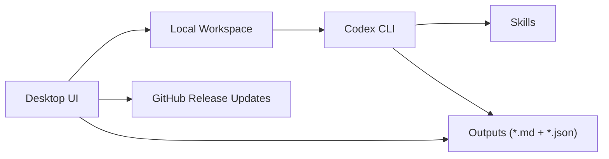

# Research Assistant

[简体中文](README.md) | [English](README.en.md)

> Version source: root `VERSION` (currently `1.1.1`)
>
> Latest published release: `v1.1.0`

`research-assistant` is a local desktop research workstation. The desktop UI handles task configuration, local status, result review, and update prompts; the real execution is performed by a local `Codex CLI`; packaged macOS and Windows installs automatically prepare the local Codex CLI runtime on first launch; GitHub Releases is the default update source.

This project is not a browser shell and not a prompt-only wrapper.

## Repository Meta

- Contribution guide: [`CONTRIBUTING.md`](CONTRIBUTING.md)
- Security policy: [`SECURITY.md`](SECURITY.md)
- Windows build workflow: [`build-windows-installer.yml`](.github/workflows/build-windows-installer.yml)

## Architecture



## Current Scope

- Configure research tasks locally
- Execute real tasks through local `Codex CLI`
- Automatically prepare `Codex CLI` on first launch of the macOS and Windows installers, with no manual Codex installation step
- Read back Markdown and JSON outputs
- Manage local recurring automations
- Build macOS `.app` / `.pkg`
- Build Windows all-in-one installer `.exe`
- Check GitHub Releases and download the right installer per platform

## Platform Matrix

| Platform | Desktop UI | Runtime Workspace | Build Requirement | Installer Output |
| --- | --- | --- | --- | --- |
| macOS | Mirrored PySide6 subtree and the current verified baseline | `~/Library/Application Support/Research Assistant/workspace` | Must be built on a macOS host | `.app` + `.pkg` |
| Windows | PySide6 subtree mirrored from the macOS baseline | `%LOCALAPPDATA%\\Research Assistant\\workspace` | Must be built on a Windows host or Windows CI | `.exe` |

Notes:

- The repository now uses two mirrored OS-specific subtrees: `MacOS/` and `Windows/`.
- `MacOS/` is the preserved, verified baseline in this migration stage, and `Windows/` mirrors it structurally.
- The Windows installer defaults to `%LOCALAPPDATA%\\Programs\\Research Assistant` and keeps the user workspace outside the install directory.

## Project Structure

```text
research-assistant/
├── .github/workflows/
├── VERSION
├── MacOS/
│   ├── desktop/
│   ├── research_assistant/
│   ├── configs/
│   ├── outputs/
│   ├── packaging/
│   ├── scripts/
│   └── skills/
├── Windows/
│   ├── desktop/
│   ├── research_assistant/
│   ├── configs/
│   ├── outputs/
│   ├── packaging/
│   ├── scripts/
│   └── skills/
├── desktop/
│   └── main.py
├── scripts/
│   ├── bootstrap.py
│   ├── build_installer.py
│   ├── run_automation.py
│   ├── smoke_test.py
│   └── install_mac.sh
├── requirements.txt
├── README.md
└── README.en.md
```

Directory responsibilities:

- `MacOS/`: current verified macOS baseline for local execution, packaging, and signing
- `Windows/`: mirrored Windows subtree for CI builds and future Windows-specific work
- repository root: docs, workflows, a unified version source, and the minimal compatibility entrypoints

The root has now been reduced to a thin compatibility layer that keeps only these entrypoints:

- `desktop/main.py`
- `scripts/bootstrap.py`
- `scripts/build_installer.py`
- `scripts/run_automation.py`
- `scripts/smoke_test.py`
- `scripts/install_mac.sh`
- `requirements.txt`

These compatibility entrypoints only forward execution into `MacOS/` or `Windows/`; they no longer contain the full implementation.

Duplicate implementations now retired from the root tree:

- `research_assistant/`
- `packaging/`
- `skills/`
- `desktop/app.py`
- `desktop/runtime.py`
- tracked default templates under root `configs/`
- tracked placeholder files under root `outputs/`

Notes:

- historical local root `configs/` / `outputs/` data may still exist on disk from older runs, but those are no longer the tracked implementation source
- the official implementation and build chain now live only in `MacOS/` and `Windows/`

## Runtime Workspace

Development mode:

- Use `MacOS/` as the preferred macOS workspace
- Use `Windows/` as the preferred Windows workspace
- The root now acts only as a thin compatibility layer; it is no longer the preferred place for development

Packaged mode:

- macOS syncs to `~/Library/Application Support/Research Assistant/workspace` on first launch
- If `Codex CLI` is missing, macOS also prepares an app-managed Node.js / Codex CLI runtime under `~/Library/Application Support/Research Assistant/runtime/codex/`
- Windows syncs to `%LOCALAPPDATA%\\Research Assistant\\workspace` on first launch
- If `Codex CLI` is missing, Windows also prepares an app-managed Node.js / Codex CLI runtime under `%LOCALAPPDATA%\\Research Assistant\\runtime\\codex\\`
- User configs, automation state, and outputs are written there

## Quick Start

```bash
python -m venv .venv
source .venv/bin/activate
python -m pip install --upgrade pip
python -m pip install -r MacOS/requirements.txt
python MacOS/desktop/main.py
```

Alternative launcher:

```bash
python MacOS/scripts/bootstrap.py
```

Compatibility entrypoints still work, but they only forward execution:

```bash
python desktop/main.py
python scripts/bootstrap.py
```

## Codex CLI Requirement

Research tasks still depend on a local `Codex CLI`, but packaged macOS and Windows builds now include the bootstrap flow, so users **no longer need to install Codex CLI manually**.

Current installer behavior:

- macOS and Windows first check for an existing system `codex`
- If none is found, it prepares a usable Node.js / npm runtime and installs `Codex CLI` into an app-managed directory
- If login has not been completed yet, it opens a terminal or command window and runs `codex login`
- In practice, the manual "install Codex CLI yourself" step is gone on the desktop installers; users usually only need to finish one authorization flow

Recommended checks:

```bash
codex --version
codex login status
```

Current behavior:

- The app first tries the current `PATH`
- It also probes the app-managed `Codex CLI`
- On macOS and Windows GUI launches, it also probes common install paths
- If `codex login status` is usable, the desktop app invokes the local CLI directly

## In-App Updates

The current desktop `Check Updates -> Download And Install` flow now has two layers:

- User-facing behavior:
  - the app checks GitHub Releases for the installer asset matching the current platform
  - when a newer version is available, packaged apps now prefer downloading the installer and starting an in-place replacement flow
- Security gate:
  - macOS only starts in-place replacement for `.pkg` installers that pass signature and notarization checks
  - Windows only starts in-place replacement for `.exe` installers that pass code-signing validation
  - when an installer is not trusted, the desktop app refuses automatic overwrite instead of bypassing the platform security model

Notes:

- development-mode or unpackaged runs do not use the in-place replacement flow; they keep the download/open-installer behavior
- therefore, in-place updates only become truly usable once the released installer assets are themselves trusted

## Automation

Check status:

```bash
python MacOS/desktop/main.py --status
```

Force-run the active automation:

```bash
python MacOS/scripts/run_automation.py --active-only --force
```

Start the local scheduler:

```bash
python MacOS/scripts/run_automation.py --daemon
```

## Build Installers

Install dependencies first:

```bash
python -m pip install -r MacOS/requirements.txt
python -m pip install -r MacOS/packaging/requirements-build.txt
```

Version source:

- the default version now comes from the root `VERSION` file
- current value: `1.1.1`
- `--version <version>` still overrides it when needed

### macOS

Build:

```bash
python MacOS/scripts/build_installer.py --platform macos
```

Artifacts:

- `MacOS/dist/installers/macos/pyinstaller/Research Assistant.app`
- `MacOS/dist/installers/macos/ResearchAssistant-macos-1.1.1.pkg`

Signing and notarization:

```bash
source MacOS/packaging/macos/signing.env
bash MacOS/packaging/macos/store_notary_credentials.sh
python MacOS/packaging/macos/sign_and_notarize.py
```

Distribution requirements:

- a public macOS `.pkg` release should always go through:
  - Developer ID Application signing
  - Developer ID Installer signing
  - notarization
- without those steps, Gatekeeper will still classify the downloaded installer as untrusted
- the repository now includes `build-macos-installer.yml` as the release-path gate; if signing secrets are missing, the release path should fail instead of uploading an unsigned package

### Windows

Hard constraints:

- Build on a native Windows host, or use the included Windows GitHub Actions workflow
- Install NSIS to generate the all-in-one `.exe` installer

Local build prep:

```powershell
python -m pip install -r Windows/requirements.txt
python -m pip install -r Windows/packaging/requirements-build.txt
winget install NSIS.NSIS
```

Build:

```powershell
python Windows/scripts/build_installer.py --platform windows
```

Artifacts:

- `Windows/dist/installers/windows/pyinstaller/Research Assistant/`
- `Windows/dist/installers/windows/ResearchAssistant-windows-1.1.1.exe`

CI option:

- Workflow file: `.github/workflows/build-windows-installer.yml`
- Tag pushes on `v*` build and upload the Windows installer
- Ordinary pushes to `main` now build workflow artifacts without uploading to the latest release by default
- Manual dispatch prefers the root `VERSION` file when `version` is omitted

Windows code signing:

- public Windows `.exe` installers should be Authenticode-signed
- `build-windows-installer.yml` now supports a signing step before release upload
- if Windows signing secrets are missing, the workflow should block uploading an unsigned installer to a release

## Updates

The top bar shows the current version and provides a `Check Updates` button.

Default behavior:

- Check on launch
- Throttle automatic checks to once per 24 hours
- Match release assets by platform
- Download `.pkg` on macOS
- Download `.exe` on Windows

Default update config lives inside each subtree:

- `MacOS/configs/app_update.yaml`
- `Windows/configs/app_update.yaml`

Packaged builds use the subtree-local config as the template before syncing it into the per-platform workspace.

```yaml
provider: github_release
github_repo: AndyWu0719/research-assistant
github_asset_pattern: ""
github_asset_pattern_by_platform:
  macos: ResearchAssistant-macos-*.pkg
  windows: ResearchAssistant-windows-*.exe
github_token_env: ""
manifest_url: ""
channel: stable
check_on_launch: true
check_interval_hours: 24
download_in_app: true
open_download_in_browser: false
```

Release flow:

1. Build the installer for the target platform
2. Push code and a version tag
3. Create a GitHub Release
4. Upload the platform installer asset

## Validation

```bash
python MacOS/scripts/smoke_test.py
```

The current smoke test checks:

- Desktop window instantiation
- Codex CLI status
- Scheduler status
- PDF resolve-only path
- Basic update-check behavior

Windows installer UI validation:

- Workflow file: `.github/workflows/validate-windows-installer-ui.yml`
- Downloads `ResearchAssistant-windows-<version>.exe` from GitHub Releases
- Performs a silent install on a GitHub-hosted Windows runner, launches the installed app, captures a screenshot, and uploads the artifact
- Includes a `Windows vs macOS UI parity` note describing what is shared and what still differs at the OS level

Reports are written to:

- `MacOS/outputs/smoke_tests/` for local macOS smoke runs
- Windows UI validation reports are uploaded as GitHub Actions artifacts rather than written into the local root `outputs/`

## Known Limits

- Research quality still depends on external retrieval quality and the local `Codex CLI`
- Windows installers can only be produced on native Windows or Windows CI
- GitHub-based updates require the correct platform asset on each release
- Public distribution still requires your own Apple / Windows signing setup
- The root now exposes only a thin compatibility layer
- Release tags should keep the `v` prefix, such as `v1.1.1`
- The `VERSION` file stores the bare version, such as `1.1.1`
- Default asset names now follow the version source: `ResearchAssistant-macos-1.1.1.pkg` and `ResearchAssistant-windows-1.1.1.exe`
- if Apple / Windows signing credentials are not configured in the repository yet, the new workflows can enforce release gates, but they still cannot produce trusted installer assets by themselves
