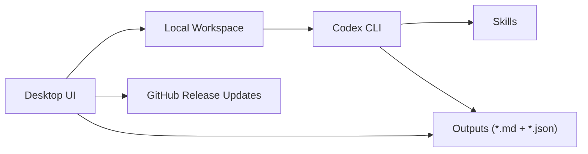

# Research Assistant

[简体中文](README.md) | [English](README.en.md)

> Current Version: `Version 1.0.0`

`research-assistant` is a local desktop research workstation. The desktop UI handles task configuration, local status, result review, and update prompts; the real execution is performed by a local `Codex CLI`; GitHub Releases is the default update source.

This project is not a browser shell and not a prompt-only wrapper.

## Architecture



## Current Scope

- Configure research tasks locally
- Execute real tasks through local `Codex CLI`
- Read back Markdown and JSON outputs
- Manage local recurring automations
- Build macOS `.app` / `.pkg`
- Build Windows all-in-one installer `.exe`
- Check GitHub Releases and download the right installer per platform

## Platform Matrix

| Platform | Desktop UI | Runtime Workspace | Build Requirement | Installer Output |
| --- | --- | --- | --- | --- |
| macOS | Same PySide6 UI | `~/Library/Application Support/Research Assistant/workspace` | Must be built on a macOS host | `.app` + `.pkg` |
| Windows | Same PySide6 UI | `%LOCALAPPDATA%\\Research Assistant\\workspace` | Must be built on a Windows host or Windows CI | `.exe` |

Notes:

- macOS and Windows reuse the same desktop shell and page layout.
- The Windows installer defaults to `%LOCALAPPDATA%\\Programs\\Research Assistant` and keeps the user workspace outside the install directory.

## Project Structure

```text
research-assistant/
├── .github/workflows/
├── desktop/
├── research_assistant/
├── configs/
├── outputs/
├── packaging/
│   ├── macos/
│   └── windows/
├── scripts/
├── skills/
├── README.md
└── README.en.md
```

Directory responsibilities:

- `desktop/`: desktop shell, pages, layout, and entry points
- `research_assistant/`: execution bridge, prompt building, config management, result loading, update checks
- `configs/`: default configs, automation configs, update configs
- `outputs/`: generated reports, downloads, prompt requests, smoke test reports
- `packaging/`: runtime dependencies, build dependencies, macOS / Windows packaging scripts
- `scripts/`: local launch, automation, packaging, smoke verification

## Runtime Workspace

Development mode:

- The current repository is used directly as the workspace

Packaged mode:

- macOS syncs to `~/Library/Application Support/Research Assistant/workspace` on first launch
- Windows syncs to `%LOCALAPPDATA%\\Research Assistant\\workspace` on first launch
- User configs, automation state, and outputs are written there

## Quick Start

```bash
python -m venv .venv
source .venv/bin/activate
python -m pip install --upgrade pip
python -m pip install -r requirements.txt
python desktop/main.py
```

Alternative launcher:

```bash
python scripts/bootstrap.py
```

## Codex CLI Requirement

Research tasks depend on a local `Codex CLI`.

Recommended checks:

```bash
codex --version
codex login status
```

Current behavior:

- The app first tries the current `PATH`
- On macOS GUI launches, it also probes common install paths
- If `codex login status` is usable, the desktop app invokes the local CLI directly

## Automation

Check status:

```bash
python desktop/main.py --status
```

Force-run the active automation:

```bash
python scripts/run_automation.py --active-only --force
```

Start the local scheduler:

```bash
python scripts/run_automation.py --daemon
```

## Build Installers

Install dependencies first:

```bash
python -m pip install -r requirements.txt
python -m pip install -r packaging/requirements-build.txt
```

### macOS

Build:

```bash
python scripts/build_installer.py --platform macos --version 1.0.0
```

Artifacts:

- `dist/installers/macos/pyinstaller/Research Assistant.app`
- `dist/installers/macos/ResearchAssistant-macos-1.0.0.pkg`

Signing and notarization:

```bash
source packaging/macos/signing.env
bash packaging/macos/store_notary_credentials.sh
python packaging/macos/sign_and_notarize.py --version 1.0.0
```

### Windows

Hard constraints:

- Build on a native Windows host, or use the included Windows GitHub Actions workflow
- Install NSIS to generate the all-in-one `.exe` installer

Local build prep:

```powershell
python -m pip install -r requirements.txt
python -m pip install -r packaging/requirements-build.txt
winget install NSIS.NSIS
```

Build:

```powershell
python scripts/build_installer.py --platform windows --version 1.0.0
```

Artifacts:

- `dist/installers/windows/pyinstaller/Research Assistant/`
- `dist/installers/windows/ResearchAssistant-windows-1.0.0.exe`

CI option:

- Workflow file: `.github/workflows/build-windows-installer.yml`
- It supports manual dispatch and tag-based builds on `v*`

## Updates

The top bar shows the current version and provides a `Check Updates` button.

Default behavior:

- Check on launch
- Throttle automatic checks to once per 24 hours
- Match release assets by platform
- Download `.pkg` on macOS
- Download `.exe` on Windows

Default config: `configs/app_update.yaml`

```yaml
provider: github_release
github_repo: AndyWu0719/research-assistant
github_asset_pattern: ""
github_asset_pattern_by_platform:
  macos: ResearchAssistant-macos-*.pkg
  windows: ResearchAssistant-windows-*.exe
github_token_env: ""
manifest_url: ""
channel: stable
check_on_launch: true
check_interval_hours: 24
download_in_app: true
open_download_in_browser: false
```

Release flow:

1. Build the installer for the target platform
2. Push code and a version tag
3. Create a GitHub Release
4. Upload the platform installer asset

## Validation

```bash
python scripts/smoke_test.py
```

The current smoke test checks:

- Desktop window instantiation
- Codex CLI status
- Scheduler status
- PDF resolve-only path
- Basic update-check behavior

Reports are written to:

- `outputs/smoke_tests/`

## Known Limits

- Research quality still depends on external retrieval quality and the local `Codex CLI`
- Windows installers can only be produced on native Windows or Windows CI
- GitHub-based updates require the correct platform asset on each release
- Public distribution still requires your own Apple / Windows signing setup
