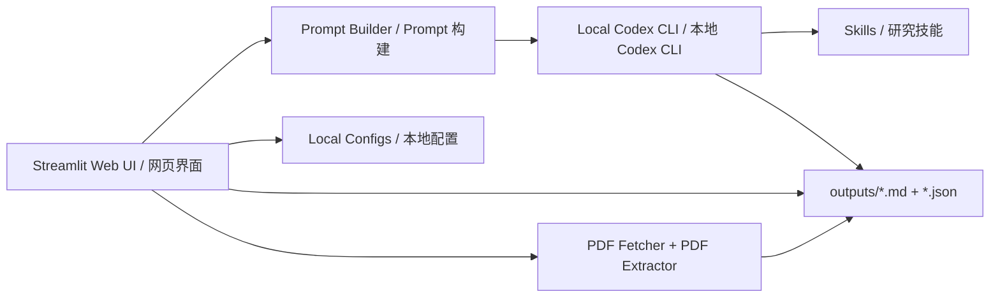

# Research Assistant

> Current Version / 当前版本: `V0.1.0-2026.03.24`  
> Previous Version / 之前版本: `V0.0.1-2026.03.23`

`research-assistant` is a local research workbench. The web UI handles parameterized interaction, status display, and result review; the local `Codex CLI` performs the real task execution; `Codex app` remains responsible for Automations.

`research-assistant` 是一个本地研究工作台。网页负责参数化交互、执行状态与结果回读；本地 `Codex CLI` 负责真实执行；`Codex app` 继续负责 Automations。

The default path is:

```text
Web UI -> Local Codex CLI -> skills / configs / outputs
```

默认链路为：

```text
网页 -> 本地 Codex CLI -> skills / configs / outputs
```

This project is not a direct OpenAI API integration, and it is not a prompt-only shell.

本项目不是 OpenAI API 直连，也不是只生成 prompt 不执行的壳。

## Version History / 版本记录

| Version | Tag | Status | Summary |
| --- | --- | --- | --- |
| `V0.0.1-2026.03.23` | `2026.03.23` | Previous baseline / 上一版本基线 | Initial local web workbench baseline with launcher preflight, core page scaffolding, and outputs write-back. Advanced page closure, bilingual switching, and stronger PDF extraction were still incomplete. / 建立了本地网页工作台基线，具备 launcher 预检查、核心页面框架与 outputs 回写；但高级页面闭环、完整双语切换与更强的 PDF 抽取仍未完全收尾。 |
| `V0.1.0-2026.03.24` | `2026.03.24` | Current / 当前版本 | Adds full zh/en switching, real live smoke-tested research pages, PDF extraction and quality sidecars, unified collapsible advanced info, local preference persistence, automation filename hardening, and low-cost validation workflow. / 新增完整中英双语切换、真实 live smoke 通过的研究页面、PDF 抽取与质量 sidecar、统一折叠高级信息、本地偏好持久化、自动化文件命名加固，以及低成本验证工作流。 |

## What Changed In `V0.1.0-2026.03.24` / `V0.1.0-2026.03.24` 更新内容

- Full bilingual switching across UI, prompt construction, default output language, bridge messages, and launcher text.  
  全站 UI、prompt 构建、默认输出语言、桥接状态消息与 launcher 终端提示已支持完整双语切换。
- Real live smoke execution was completed for `Top 10 Literature Scan`, `Paper Deep Read`, `PDF Downloads`, `Topic Map`, `Idea Feasibility`, and `Constraint Explorer`.  
  已对 `Top 10 Literature Scan`、`Paper Deep Read`、`PDF Downloads`、`Topic Map`、`Idea Feasibility`、`Constraint Explorer` 完成真实 live smoke 执行。
- A PDF extraction and cleanup stage now runs before `paper-reader`, and writes cleaned text plus a quality sidecar to disk.  
  `paper-reader` 前新增 PDF 文本抽取与清洗步骤，并将清洗文本与质量 sidecar 真实落盘。
- Advanced information is now consistently collapsed by default across the site.  
  全站高级信息已统一改为默认折叠展示。
- User preferences are now persisted to local config files and restored after refresh or restart.  
  用户偏好已写入本地配置文件，并支持刷新后与重启后恢复。
- Automation configs no longer default to `daily_top10.yaml`; filenames are generated from the user task name plus a stable hash.  
  自动化配置不再默认固定为 `daily_top10.yaml`，而是使用任务名称清洗后加稳定哈希生成文件名。
- `ui/requirements.txt` now explicitly includes `pypdf` because PDF extraction depends on it.  
  `ui/requirements.txt` 已显式加入 `pypdf`，因为 PDF 抽取链路依赖该库。

## Architecture / 系统架构



## Project Scope / 项目定位

### English

- Build a practical local research assistant around the user's already logged-in Codex CLI.
- Keep the web layer focused on interaction, configuration, and results, instead of duplicating research logic in the frontend.
- Preserve a real write-back workflow into `outputs/`, with Markdown reports and JSON sidecars for structured UI reading.
- Prefer low-cost verification by default: use `economy` first, then move up only when basic validation cannot be completed.

### 中文

- 围绕用户本地已登录的 Codex CLI，构建一个可执行的研究助手。
- 让网页层专注于交互、配置和结果展示，而不是把研究逻辑搬进前端。
- 保持真实落盘到 `outputs/` 的工作流，Markdown 报告和 JSON sidecar 同步输出，便于结构化回读。
- 默认优先低成本验证：先用 `economy`，只有在最基本验证无法完成时再升档。

## Pages / 页面功能

| Page | Main Use | Typical Inputs | Outputs |
| --- | --- | --- | --- |
| `Home` | Project overview, parameter glossary, defaults, recent outputs. / 项目说明、参数解释、默认值与最近产物总览。 | None / 无 | Status overview / 状态总览 |
| `Top 10 Literature Scan` | Structured literature scan and ranking for a field. / 面向研究方向的结构化文献巡检与排序。 | Field, time range, sources, ranking profile, constraints, Top K / 研究领域、时间范围、来源、排序 profile、约束、Top K | `outputs/daily_top10/*.md` + `.json` |
| `Paper Deep Read` | Structured deep reading for one paper. / 单篇论文结构化精读。 | arXiv ID, DOI, URL, local PDF / arXiv ID、DOI、URL、本地 PDF | `outputs/paper_summaries/*.md` + `.json` |
| `PDF Downloads` | Real PDF download, optionally chained into deep reading. / 真实下载 PDF，并可串联精读。 | Paper references / 论文引用 | `outputs/pdfs/*.pdf` + `.source.json` |
| `Topic Map` | Tiered paper map and reading path for a topic. / 为一个方向生成分层论文地图与阅读路径。 | Topic, time window, return count, ranking mode / topic、时间窗口、返回数量、排序方式 | `outputs/topic_maps/*.md` + `.json` |
| `Idea Feasibility` | Feasibility analysis for a research idea. / 研究想法的可行性分析。 | Idea, target field, compute budget, data budget, risk preference / idea、目标领域、算力预算、数据预算、风险偏好 | `outputs/feasibility_reports/*.md` + `.json` |
| `Constraint Explorer` | Constraint-aware direction exploration. / 现实约束下的方向探索。 | Field, compute limit, data limit, reproducibility/open-source preference / 研究领域、算力限制、数据限制、复现/开源偏好 | `outputs/constraint_reports/*.md` + `.json` |
| `Automation Setup` | Save recurring scan configs and build Codex app automation prompts. / 保存周期性巡检配置并生成 Codex app automation prompt。 | Task name, field, time range, sources, quality profile, run time / 任务名、研究领域、时间范围、来源、质量档位、运行时间 | `configs/daily_profile.yaml`, `configs/automations/*.yaml` |

## UI Conventions / 页面与交互规范

- The sidebar uses custom navigation with title-cased page labels and a global language selector.  
  左侧栏使用自定义导航，页面标题统一规范化，并提供全局语言切换。
- Advanced information is collapsed by default, including raw prompts, output paths, debug payloads, PDF extraction details, config previews, and saved preferences.  
  原始 prompt、输出路径、调试信息、PDF 抽取详情、配置预览和本地偏好等高级信息默认折叠。
- The UI always prefers showing the main workflow first, and leaves expert-level details in consistent expanders.  
  页面优先展示普通用户主流程，专业用户信息统一放入风格一致的折叠栏。

## Bilingual Support / 双语支持

### Current Behavior / 当前行为

- The sidebar language switch writes the selected language to `configs/user_preferences.yaml`.  
  左侧栏语言切换会写入 `configs/user_preferences.yaml`。
- The selected language is restored after browser refresh and app restart.  
  浏览器刷新和网页重启后会恢复上次语言。
- The selected language affects:
  - UI labels, buttons, help text, and expander titles
  - home-page explanations and glossary
  - prompt-builder instructions
  - bridge-layer status and fallback messages
  - launcher terminal messages
  - default output language
  - paper summary filename suffixes such as `-zh.md` and `-en.md`
- 当前语言会影响：
  - UI 文案、按钮、帮助文本与折叠栏标题
  - 首页说明和参数解释
  - prompt_builder 生成的任务说明
  - bridge 层状态与回退消息
  - launcher 终端提示
  - 默认输出语言
  - 论文精读文件后缀，例如 `-zh.md`、`-en.md`

### Conservative Boundary / 保守边界

- Historical result files are not auto-translated; they are shown in the language they were originally generated in.  
  历史结果文件不会自动翻译，而是按生成时语言原样展示。
- Old configs with Chinese enum values are normalized on load, but not force-rewritten in bulk.  
  旧配置中的中文枚举值会在加载时自动归一化，但不会被批量强制回写。

## PDF Extraction And Deep Reading / PDF 抽取与精读链路

The current `paper-reader` pipeline is:

```text
Reference / Local PDF
  -> optional paper-fetcher download
  -> local PDF text extraction and cleanup
  -> outputs/pdf_text/<slug>-cleaned.txt
  -> outputs/pdf_text/<slug>-cleaned.json
  -> paper-reader structured deep read
```

当前 `paper-reader` 链路为：

```text
论文引用 / 本地 PDF
  -> 如有需要，先走 paper-fetcher 下载
  -> 本地 PDF 文本抽取与清洗
  -> outputs/pdf_text/<slug>-cleaned.txt
  -> outputs/pdf_text/<slug>-cleaned.json
  -> paper-reader 结构化精读
```

Extraction quality levels:

- `good`: body text is usable and is preferred as the reading source. / 正文可用，优先基于清洗文本做精读。
- `mixed`: partial page loss exists; tables, formulas, and experiments must be treated cautiously. / 存在部分页面缺失，表格、公式和实验细节要谨慎处理。
- `poor`: large parts of the body are missing; only conservative interpretation is allowed. / 正文缺失较多，只能保守解读。

Hard constraints:

- Do not fabricate tables, formulas, or experiment details.  
  不允许伪造表格、公式或实验细节。
- When evidence is insufficient, uncertainty must be stated explicitly.  
  当证据不足时，必须明确标注不确定性。

## Local Persistence / 本地持久化方案

### User Preferences / 用户偏好

- File: `configs/user_preferences.yaml`
- Stores:
  - UI language
  - last-used field, time range, sources, ranking profile, constraints, and Top K
  - per-page quality preferences
  - paper-reader defaults such as summary depth and auto-fetch behavior
  - topic-mapper / idea-feasibility / constraint-explorer defaults
  - active automation task name and filename
- Does not store:
  - Codex login state
  - API keys
  - any credential material

### Interesting Papers / 感兴趣论文

- File: `configs/interesting_papers.json`
- Purpose: store the papers marked by users from scan results, for later PDF download or deep reading.

### Daily Profile / 每日巡检默认配置

- File: `configs/daily_profile.yaml`
- Purpose: store the current default profile used by scan-style tasks.

## Automation Config Naming / 自动化配置命名

- Directory: `configs/automations/`
- Active index file: `configs/automations/index.yaml`
- Naming rule:
  - sanitize the user-provided task name
  - append a stable short hash
  - save as `<task-name>--<hash>.yaml`
- Example:
  - `每日一篇文献--4bb24c0f.yaml`
- The page explicitly shows:
  - task name
  - generated filename
  - save directory
  - active config path

## Requirements / 依赖

The root `requirements.txt` delegates to `ui/requirements.txt`.

根目录的 `requirements.txt` 通过 `-r ui/requirements.txt` 转发到 UI 依赖文件。

Current required packages:

- `streamlit>=1.40,<2`
- `PyYAML>=6.0`
- `pypdf>=5.0,<6`

`pypdf` was added explicitly in `V0.1.0-2026.03.24` because the PDF extraction layer depends on it.

`V0.1.0-2026.03.24` 已显式补充 `pypdf`，因为 PDF 文本抽取层依赖该库。

## Quick Start / 快速启动

```bash
python -m venv .venv
source .venv/bin/activate
python -m pip install --upgrade pip
python -m pip install -r requirements.txt
python ui/launcher.py
```

Recommended preflight checks:

```bash
codex --version
codex login status
```

建议在启动前先确认以上两条命令可用。

## Validation / 验证与推荐档位

### Live-Verified Pages / 已真实打通页面

- `Top 10 Literature Scan`
- `Paper Deep Read`
- `PDF Downloads` including `Download And Read`
- `Topic Map`
- `Idea Feasibility`
- `Constraint Explorer`

### Smoke Reports / Smoke 日志

- Output directory: `outputs/smoke_tests/`
- Script: `scripts/live_smoke_test.py`
- Language options:
  - `--language zh-CN`
  - `--language en-US`

### Cost Guidance / 成本建议

- `economy`: preferred for smoke tests, PDF download, lightweight reading, and initial validation.  
  `economy`：优先用于 smoke test、PDF 下载、轻量精读和初步验证。
- `balanced`: default for normal use when slightly stronger reasoning is needed.  
  `balanced`：适合常规使用与一般强度分析。
- Only move above `balanced` when lower-cost profiles cannot complete basic validation.  
  只有在低成本档位无法完成最基本验证时，才建议继续升档。

## Known Limits / 当前边界

- The project still depends on a locally installed and logged-in `Codex CLI`.  
  项目仍依赖本地可执行且已登录的 `Codex CLI`。
- The actual `model / reasoning effort` for `Codex app` Automations still needs to be set manually in the app.  
  `Codex app Automation` 的实际 `model / reasoning effort` 仍需在 App 内手动设置。
- PDF extraction quality depends on the source file layout; scanned or image-heavy PDFs can degrade badly.  
  PDF 抽取质量受源文件版式影响，扫描版或图片页会明显变差。
- Real outputs, PDFs, prompt requests, and smoke logs under `outputs/` are usually not meant for public commits.  
  `outputs/` 中的真实结果、PDF、prompt request 和 smoke log 通常不适合直接提交到公开仓库。
- Legacy `configs/automations/daily_top10.yaml` may remain in the repo, but it is no longer the default active config.  
  历史遗留的 `configs/automations/daily_top10.yaml` 可能仍然存在，但不再作为默认活动配置。

## Directory Layout / 目录结构

```text
research-assistant/
├── .streamlit/config.toml
├── configs/
│   ├── automations/
│   │   ├── index.yaml
│   │   ├── daily_top10.yaml
│   │   └── <task-name>--<hash>.yaml
│   ├── daily_profile.yaml
│   ├── execution_profiles.yaml
│   ├── interesting_papers.json
│   ├── ranking_profiles.md
│   ├── source_policies.md
│   └── user_preferences.yaml
├── outputs/
│   ├── daily_top10/
│   ├── paper_summaries/
│   ├── topic_maps/
│   ├── feasibility_reports/
│   ├── constraint_reports/
│   ├── pdfs/
│   ├── pdf_text/
│   ├── prompt_requests/
│   └── smoke_tests/
├── scripts/
│   └── live_smoke_test.py
├── ui/
│   ├── app.py
│   ├── launcher.py
│   ├── pages/
│   ├── requirements.txt
│   └── services/
└── skills/
```

## License

This repository currently ships with the `MIT License`.

仓库当前附带 `MIT License`。
