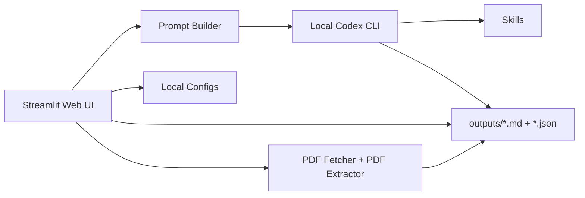
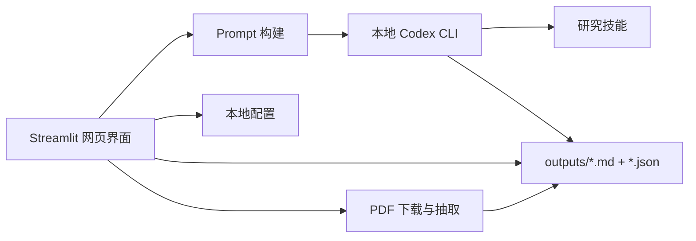

# Research Assistant

> Current Version / 当前版本: `V0.1.0-2026.03.24`  
> Previous Version / 之前版本: `V0.0.1-2026.03.23`

## English

`research-assistant` is a local research workbench. The web UI handles parameterized interaction, status display, and result review; the local `Codex CLI` performs real task execution; `Codex app` remains responsible for Automations.

Default path:

```text
Web UI -> Local Codex CLI -> skills / configs / outputs
```

This project is not a direct OpenAI API integration, and it is not a prompt-only shell.

### Version History

| Version | Tag | Status | Summary |
| --- | --- | --- | --- |
| `V0.0.1-2026.03.23` | `2026.03.23` | Previous baseline | Initial local web workbench baseline with launcher preflight, core page scaffolding, and outputs write-back. Advanced page closure, bilingual switching, and stronger PDF extraction were still incomplete. |
| `V0.1.0-2026.03.24` | `2026.03.24` | Current | Adds full zh/en switching, real live smoke-tested research pages, PDF extraction and quality sidecars, unified collapsible advanced info, local preference persistence, automation filename hardening, and a low-cost validation workflow. |

### What Changed In `V0.1.0-2026.03.24`

- Full bilingual switching across UI, prompt construction, default output language, bridge messages, and launcher text.
- Real live smoke execution was completed for `Top 10 Literature Scan`, `Paper Deep Read`, `PDF Downloads`, `Topic Map`, `Idea Feasibility`, and `Constraint Explorer`.
- A PDF extraction and cleanup stage now runs before `paper-reader`, and writes cleaned text plus a quality sidecar to disk.
- Advanced information is now consistently collapsed by default across the site.
- User preferences are now persisted to local config files and restored after refresh or restart.
- Automation configs no longer default to `daily_top10.yaml`; filenames are generated from the user task name plus a stable hash.
- `ui/requirements.txt` now explicitly includes `pypdf` because PDF extraction depends on it.

### Architecture



### Project Scope

- Build a practical local research assistant around the user's already logged-in Codex CLI.
- Keep the web layer focused on interaction, configuration, and results, instead of duplicating research logic in the frontend.
- Preserve a real write-back workflow into `outputs/`, with Markdown reports and JSON sidecars for structured UI reading.
- Prefer low-cost verification by default: use `economy` first, then move up only when basic validation cannot be completed.

### Pages

| Page | Main Use | Typical Inputs | Outputs |
| --- | --- | --- | --- |
| `Home` | Project overview, parameter glossary, defaults, and recent outputs. | None | Status overview |
| `Top 10 Literature Scan` | Structured literature scan and ranking for a field. | Field, time range, sources, ranking profile, constraints, Top K | `outputs/daily_top10/*.md` + `.json` |
| `Paper Deep Read` | Structured deep reading for one paper. | arXiv ID, DOI, URL, local PDF | `outputs/paper_summaries/*.md` + `.json` |
| `PDF Downloads` | Real PDF download, optionally chained into deep reading. | Paper references | `outputs/pdfs/*.pdf` + `.source.json` |
| `Topic Map` | Tiered paper map and reading path for a topic. | Topic, time window, return count, ranking mode | `outputs/topic_maps/*.md` + `.json` |
| `Idea Feasibility` | Feasibility analysis for a research idea. | Idea, target field, compute budget, data budget, risk preference | `outputs/feasibility_reports/*.md` + `.json` |
| `Constraint Explorer` | Constraint-aware direction exploration. | Field, compute limit, data limit, reproducibility and open-source preference | `outputs/constraint_reports/*.md` + `.json` |
| `Automation Setup` | Save recurring scan configs and build Codex app automation prompts. | Task name, field, time range, sources, quality profile, run time | `configs/daily_profile.yaml`, `configs/automations/*.yaml` |

### UI Conventions

- The sidebar uses custom navigation with title-cased page labels and a global language selector.
- Advanced information is collapsed by default, including raw prompts, output paths, debug payloads, PDF extraction details, config previews, and saved preferences.
- The UI always prioritizes the main workflow first and leaves expert-level details in consistent expanders.

### Bilingual Support

Current behavior:

- The sidebar language switch writes the selected language to `configs/user_preferences.yaml`.
- The selected language is restored after browser refresh and app restart.
- The selected language affects UI labels, buttons, help text, expander titles, home-page explanations, prompt-builder instructions, bridge-layer messages, launcher terminal messages, default output language, and paper summary filename suffixes such as `-zh.md` and `-en.md`.

Conservative boundary:

- Historical result files are not auto-translated; they are shown in the language they were originally generated in.
- Old configs with Chinese enum values are normalized on load, but not force-rewritten in bulk.

### PDF Extraction And Deep Reading

Current `paper-reader` pipeline:

```text
Reference / Local PDF
  -> optional paper-fetcher download
  -> local PDF text extraction and cleanup
  -> outputs/pdf_text/<slug>-cleaned.txt
  -> outputs/pdf_text/<slug>-cleaned.json
  -> paper-reader structured deep read
```

Extraction quality levels:

- `good`: body text is usable and preferred as the reading source.
- `mixed`: partial page loss exists; tables, formulas, and experiments must be treated cautiously.
- `poor`: large parts of the body are missing; only conservative interpretation is allowed.

Hard constraints:

- Do not fabricate tables, formulas, or experiment details.
- When evidence is insufficient, uncertainty must be stated explicitly.

### Local Persistence

User preferences:

- File: `configs/user_preferences.yaml`
- Stores UI language, last-used field, time range, sources, ranking profile, constraints, Top K, per-page quality preferences, paper-reader defaults, topic-mapper defaults, idea-feasibility defaults, constraint-explorer defaults, and active automation name and filename.
- Does not store Codex login state, API keys, or any credential material.

Interesting papers:

- File: `configs/interesting_papers.json`
- Purpose: store papers marked by users from scan results for later PDF download or deep reading.

Daily profile:

- File: `configs/daily_profile.yaml`
- Purpose: store the current default profile used by scan-style tasks.

### Automation Config Naming

- Directory: `configs/automations/`
- Active index file: `configs/automations/index.yaml`
- Naming rule: sanitize the user-provided task name, append a stable short hash, and save as `<task-name>--<hash>.yaml`
- Example: `每日一篇文献--4bb24c0f.yaml`
- The page explicitly shows the task name, generated filename, save directory, and active config path.

### Requirements

The root `requirements.txt` delegates to `ui/requirements.txt`.

Current required packages:

- `streamlit>=1.40,<2`
- `PyYAML>=6.0`
- `pypdf>=5.0,<6`

`pypdf` was added explicitly in `V0.1.0-2026.03.24` because the PDF extraction layer depends on it.

### Quick Start

```bash
python -m venv .venv
source .venv/bin/activate
python -m pip install --upgrade pip
python -m pip install -r requirements.txt
python ui/launcher.py
```

Recommended preflight checks:

```bash
codex --version
codex login status
```

### Validation

Live-verified pages:

- `Top 10 Literature Scan`
- `Paper Deep Read`
- `PDF Downloads` including `Download And Read`
- `Topic Map`
- `Idea Feasibility`
- `Constraint Explorer`

Smoke reports:

- Output directory: `outputs/smoke_tests/`
- Script: `scripts/live_smoke_test.py`
- Language options: `--language zh-CN` and `--language en-US`

Cost guidance:

- `economy`: preferred for smoke tests, PDF download, lightweight reading, and initial validation.
- `balanced`: default for normal use when slightly stronger reasoning is needed.
- Only move above `balanced` when lower-cost profiles cannot complete basic validation.

### Known Limits

- The project still depends on a locally installed and logged-in `Codex CLI`.
- The actual `model / reasoning effort` for `Codex app` Automations still needs to be set manually in the app.
- PDF extraction quality depends on source file layout; scanned or image-heavy PDFs can degrade badly.
- Real outputs, PDFs, prompt requests, and smoke logs under `outputs/` are usually not meant for public commits.
- Legacy `configs/automations/daily_top10.yaml` may remain in the repo, but it is no longer the default active config.

### Directory Layout

```text
research-assistant/
├── .streamlit/config.toml
├── configs/
│   ├── automations/
│   │   ├── index.yaml
│   │   ├── daily_top10.yaml
│   │   └── <task-name>--<hash>.yaml
│   ├── daily_profile.yaml
│   ├── execution_profiles.yaml
│   ├── interesting_papers.json
│   ├── ranking_profiles.md
│   ├── source_policies.md
│   └── user_preferences.yaml
├── outputs/
│   ├── daily_top10/
│   ├── paper_summaries/
│   ├── topic_maps/
│   ├── feasibility_reports/
│   ├── constraint_reports/
│   ├── pdfs/
│   ├── pdf_text/
│   ├── prompt_requests/
│   └── smoke_tests/
├── scripts/
│   └── live_smoke_test.py
├── ui/
│   ├── app.py
│   ├── launcher.py
│   ├── pages/
│   ├── requirements.txt
│   └── services/
└── skills/
```

### License

This repository currently ships with the `MIT License`.

## 中文

`research-assistant` 是一个本地研究工作台。网页负责参数化交互、执行状态展示与结果回读；本地 `Codex CLI` 负责真实执行；`Codex app` 继续负责 Automations。

默认链路：

```text
网页 -> 本地 Codex CLI -> skills / configs / outputs
```

本项目不是 OpenAI API 直连，也不是只生成 prompt 不执行的壳。

### 版本记录

| 版本 | 标记 | 状态 | 说明 |
| --- | --- | --- | --- |
| `V0.0.1-2026.03.23` | `2026.03.23` | 上一版本基线 | 建立了本地网页工作台基线，具备 launcher 预检查、核心页面框架与 outputs 回写；但高级页面闭环、完整双语切换与更强的 PDF 抽取仍未完全收尾。 |
| `V0.1.0-2026.03.24` | `2026.03.24` | 当前版本 | 新增完整中英双语切换、真实 live smoke 通过的研究页面、PDF 抽取与质量 sidecar、统一折叠高级信息、本地偏好持久化、自动化文件命名加固，以及低成本验证工作流。 |

### `V0.1.0-2026.03.24` 更新内容

- 全站 UI、prompt 构建、默认输出语言、桥接状态消息与 launcher 终端提示已支持完整双语切换。
- 已对 `Top 10 Literature Scan`、`Paper Deep Read`、`PDF Downloads`、`Topic Map`、`Idea Feasibility`、`Constraint Explorer` 完成真实 live smoke 执行。
- `paper-reader` 前新增 PDF 文本抽取与清洗步骤，并将清洗文本与质量 sidecar 真实落盘。
- 全站高级信息已统一改为默认折叠展示。
- 用户偏好已写入本地配置文件，并支持刷新后与重启后恢复。
- 自动化配置不再默认固定为 `daily_top10.yaml`，而是使用任务名称清洗后加稳定哈希生成文件名。
- `ui/requirements.txt` 已显式加入 `pypdf`，因为 PDF 抽取链路依赖该库。

### 系统架构



### 项目定位

- 围绕用户本地已登录的 Codex CLI，构建一个可执行的研究助手。
- 让网页层专注于交互、配置和结果展示，而不是把研究逻辑搬进前端。
- 保持真实落盘到 `outputs/` 的工作流，Markdown 报告和 JSON sidecar 同步输出，便于结构化回读。
- 默认优先低成本验证：先用 `economy`，只有在最基本验证无法完成时再升档。

### 页面功能

| 页面 | 主要用途 | 典型输入 | 输出 |
| --- | --- | --- | --- |
| `Home` | 项目总览、参数解释、默认值与最近产物。 | 无 | 状态总览 |
| `Top 10 Literature Scan` | 面向研究方向的结构化文献巡检与排序。 | 研究领域、时间范围、来源、排序 profile、约束、Top K | `outputs/daily_top10/*.md` + `.json` |
| `Paper Deep Read` | 单篇论文结构化精读。 | arXiv ID、DOI、URL、本地 PDF | `outputs/paper_summaries/*.md` + `.json` |
| `PDF Downloads` | 真实下载 PDF，并可串联精读。 | 论文引用 | `outputs/pdfs/*.pdf` + `.source.json` |
| `Topic Map` | 为一个方向生成分层论文地图与阅读路径。 | topic、时间窗口、返回数量、排序方式 | `outputs/topic_maps/*.md` + `.json` |
| `Idea Feasibility` | 研究想法的可行性分析。 | idea、目标领域、算力预算、数据预算、风险偏好 | `outputs/feasibility_reports/*.md` + `.json` |
| `Constraint Explorer` | 现实约束下的方向探索。 | 研究领域、算力限制、数据限制、复现与开源偏好 | `outputs/constraint_reports/*.md` + `.json` |
| `Automation Setup` | 保存周期性巡检配置并生成 Codex app automation prompt。 | 任务名、研究领域、时间范围、来源、质量档位、运行时间 | `configs/daily_profile.yaml`、`configs/automations/*.yaml` |

### 页面与交互规范

- 左侧栏使用自定义导航，页面标题统一规范化，并提供全局语言切换。
- 原始 prompt、输出路径、调试信息、PDF 抽取详情、配置预览和本地偏好等高级信息默认折叠。
- 页面优先展示普通用户主流程，专业用户信息统一放入风格一致的折叠栏。

### 双语支持

当前行为：

- 左侧栏语言切换会写入 `configs/user_preferences.yaml`。
- 浏览器刷新和网页重启后会恢复上次语言。
- 当前语言会影响 UI 文案、按钮、帮助文本、折叠栏标题、首页说明、prompt 构建说明、bridge 层状态消息、launcher 终端提示、默认输出语言，以及论文精读文件后缀，如 `-zh.md` 和 `-en.md`。

保守边界：

- 历史结果文件不会自动翻译，而是按生成时语言原样展示。
- 旧配置中的中文枚举值会在加载时自动归一化，但不会被批量强制回写。

### PDF 抽取与精读链路

当前 `paper-reader` 链路：

```text
论文引用 / 本地 PDF
  -> 如有需要，先走 paper-fetcher 下载
  -> 本地 PDF 文本抽取与清洗
  -> outputs/pdf_text/<slug>-cleaned.txt
  -> outputs/pdf_text/<slug>-cleaned.json
  -> paper-reader 结构化精读
```

抽取质量分级：

- `good`：正文可用，优先基于清洗文本做精读。
- `mixed`：存在部分页面缺失，表格、公式和实验细节要谨慎处理。
- `poor`：正文缺失较多，只能保守解读。

硬性约束：

- 不允许伪造表格、公式或实验细节。
- 当证据不足时，必须明确标注不确定性。

### 本地持久化

用户偏好：

- 文件：`configs/user_preferences.yaml`
- 保存内容：UI 语言、最近使用的领域、时间范围、来源、排序 profile、约束、Top K、各页面质量档位、论文精读默认项、topic-mapper 默认项、idea-feasibility 默认项、constraint-explorer 默认项，以及当前 automation 名称和文件名。
- 不保存内容：Codex 登录状态、API keys、任何凭据材料。

感兴趣论文：

- 文件：`configs/interesting_papers.json`
- 作用：保存用户从巡检结果中标记的论文，供后续下载 PDF 或继续精读。

每日巡检默认配置：

- 文件：`configs/daily_profile.yaml`
- 作用：保存巡检类任务当前使用的默认配置。

### 自动化配置命名

- 目录：`configs/automations/`
- 当前活动索引文件：`configs/automations/index.yaml`
- 命名规则：对用户输入的任务名做清洗，拼接稳定短哈希，保存为 `<task-name>--<hash>.yaml`
- 示例：`每日一篇文献--4bb24c0f.yaml`
- 页面会显式展示任务名、生成文件名、保存目录和当前活动配置路径。

### 依赖

根目录的 `requirements.txt` 通过 `-r ui/requirements.txt` 转发到 UI 依赖文件。

当前依赖：

- `streamlit>=1.40,<2`
- `PyYAML>=6.0`
- `pypdf>=5.0,<6`

`V0.1.0-2026.03.24` 已显式补充 `pypdf`，因为 PDF 文本抽取层依赖该库。

### 快速启动

```bash
python -m venv .venv
source .venv/bin/activate
python -m pip install --upgrade pip
python -m pip install -r requirements.txt
python ui/launcher.py
```

建议启动前先确认：

```bash
codex --version
codex login status
```

### 验证与推荐档位

已真实打通页面：

- `Top 10 Literature Scan`
- `Paper Deep Read`
- `PDF Downloads` including `Download And Read`
- `Topic Map`
- `Idea Feasibility`
- `Constraint Explorer`

Smoke 日志：

- 输出目录：`outputs/smoke_tests/`
- 脚本：`scripts/live_smoke_test.py`
- 语言参数：`--language zh-CN` 与 `--language en-US`

成本建议：

- `economy`：优先用于 smoke test、PDF 下载、轻量精读和初步验证。
- `balanced`：适合常规使用与一般强度分析。
- 只有在低成本档位无法完成最基本验证时，才建议继续升档。

### 当前边界

- 项目仍依赖本地可执行且已登录的 `Codex CLI`。
- `Codex app Automation` 的实际 `model / reasoning effort` 仍需在 App 内手动设置。
- PDF 抽取质量受源文件版式影响，扫描版或图片页会明显变差。
- `outputs/` 中的真实结果、PDF、prompt request 和 smoke log 通常不适合直接提交到公开仓库。
- 历史遗留的 `configs/automations/daily_top10.yaml` 可能仍然存在，但不再作为默认活动配置。

### 目录结构

```text
research-assistant/
├── .streamlit/config.toml
├── configs/
│   ├── automations/
│   │   ├── index.yaml
│   │   ├── daily_top10.yaml
│   │   └── <task-name>--<hash>.yaml
│   ├── daily_profile.yaml
│   ├── execution_profiles.yaml
│   ├── interesting_papers.json
│   ├── ranking_profiles.md
│   ├── source_policies.md
│   └── user_preferences.yaml
├── outputs/
│   ├── daily_top10/
│   ├── paper_summaries/
│   ├── topic_maps/
│   ├── feasibility_reports/
│   ├── constraint_reports/
│   ├── pdfs/
│   ├── pdf_text/
│   ├── prompt_requests/
│   └── smoke_tests/
├── scripts/
│   └── live_smoke_test.py
├── ui/
│   ├── app.py
│   ├── launcher.py
│   ├── pages/
│   ├── requirements.txt
│   └── services/
└── skills/
```

### 许可证

仓库当前附带 `MIT License`。
