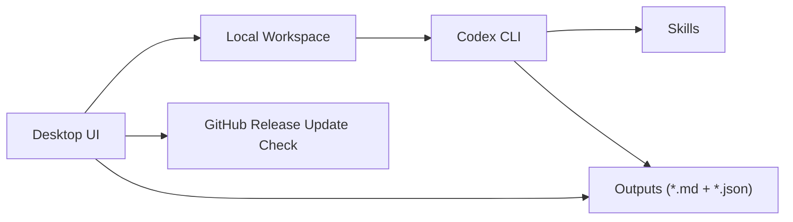
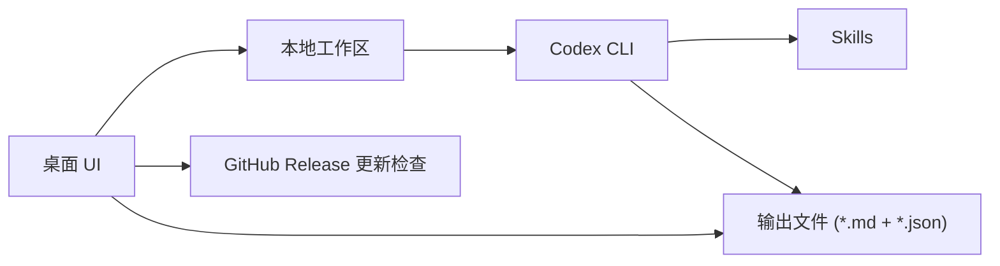

# Research Assistant

> Current Version / 当前版本: `Version 1.0.0`

## English

`research-assistant` is a native macOS desktop research workbench. The desktop UI handles configuration, local status, result review, and update prompts; the local `Codex CLI` performs real task execution; GitHub Releases is used as the default update source.

Default path:

```text
Research Assistant Desktop
  -> local workspace
  -> Codex CLI
  -> Markdown + JSON outputs
  -> GitHub release update checks
```

This project is not a browser shell anymore, and it is not a prompt-only wrapper.

### Scope

- Configure research tasks locally
- Execute tasks through local `Codex CLI`
- Read back Markdown and JSON results
- Manage local recurring automations
- Build and distribute macOS `.app` and `.pkg`
- Check for updates and install by replacement

### Platform

- Current supported release platform: macOS
- Current distribution formats: `.app` and `.pkg`
- Current application version: `Version 1.0.0`

### Architecture



### Project Structure

```text
research-assistant/
├── AGENTS.md
├── desktop/
│   ├── app.py
│   ├── main.py
│   └── runtime.py
├── research_assistant/
│   ├── app_update.py
│   ├── automation_runtime.py
│   ├── codex_bridge.py
│   ├── config_store.py
│   ├── file_naming.py
│   ├── language.py
│   ├── paper_sources.py
│   ├── pdf_extractor.py
│   ├── prompt_builder.py
│   ├── result_loader.py
│   └── ui_text.py
├── configs/
│   ├── app_update.yaml
│   ├── scan_defaults.yaml
│   └── automations/
├── outputs/
├── packaging/
│   ├── runtime-requirements.txt
│   ├── requirements-build.txt
│   └── macos/
├── scripts/
│   ├── bootstrap.py
│   ├── build_installer.py
│   ├── run_automation.py
│   └── smoke_test.py
└── skills/
```

Directory responsibilities:

- `desktop/`: desktop shell, pages, layout, and entry points
- `research_assistant/`: execution bridge, prompt building, config management, result loading, updates
- `configs/`: default configs, automation configs, update configs
- `outputs/`: generated reports, downloaded files, prompt requests, smoke test reports
- `packaging/`: runtime dependencies, build dependencies, signing and notarization scripts
- `scripts/`: local launch, automation, packaging, smoke verification

### Runtime Workspace

Development mode:

- The current repository is used directly as the workspace

Packaged mode:

- On first launch, the bundled template is synced to  
  `~/Library/Application Support/Research Assistant/workspace`
- User configs, automation state, and outputs are written there

### Scan Defaults

- Default scan config file: `configs/scan_defaults.yaml`
- This replaces the old `configs/daily_profile.yaml`
- Existing packaged workspaces migrate from the legacy filename automatically

### Quick Start

```bash
python -m venv .venv
source .venv/bin/activate
python -m pip install --upgrade pip
python -m pip install -r requirements.txt
python desktop/main.py
```

Alternative launcher:

```bash
python scripts/bootstrap.py
```

### Codex CLI Requirement

Research tasks depend on a local `Codex CLI`.

Recommended checks:

```bash
codex --version
codex login status
```

Current behavior:

- The app first tries the current `PATH`
- On macOS GUI launches, it also probes common install paths
- If `codex login status` is usable, the desktop app directly invokes the local CLI

### Automation

Check status:

```bash
python desktop/main.py --status
```

Force-run the current automation:

```bash
python scripts/run_automation.py --active-only --force
```

Start the local scheduler:

```bash
python scripts/run_automation.py --daemon
```

### Updates

The top bar shows the current version and provides a `Check Updates` button.

Current default behavior:

- Check on launch
- Throttle automatic checks to once per 24 hours
- Detect newer versions from GitHub Releases
- Download the `.pkg` inside the app
- Open the installer and let macOS perform a replacement install

Default update config:

- File: `configs/app_update.yaml`

```yaml
provider: github_release
github_repo: AndyWu0719/research-assistant
github_asset_pattern: ResearchAssistant-macos-*.pkg
github_token_env: ""
manifest_url: ""
channel: stable
check_on_launch: true
check_interval_hours: 24
download_in_app: true
open_download_in_browser: false
```

Field meanings:

- `provider: github_release`: use GitHub Releases as the update source
- `github_repo`: repository in `owner/repo` format
- `github_asset_pattern`: pattern used to find the macOS package asset
- `github_token_env`: optional environment variable name for a GitHub token, useful for private repos
- `manifest_url`: reserved fallback for a custom manifest flow, not the default mode

Release workflow:

1. Build a new package such as `ResearchAssistant-macos-1.0.1.pkg`
2. Push code and a version tag
3. Create a GitHub Release
4. Upload the `.pkg` as a release asset

The client parses the latest version from the asset name, release title, or tag.

### Why Sparkle Is Not Included Yet

Sparkle is not part of the current `Version 1.0.0` release.

Reason:

- The current chain already supports automatic checks, in-app download, and replacement install
- Sparkle is more useful when you need tighter native macOS self-update behavior, stronger feed signing, and richer updater UX
- It can be added later as a second-stage upgrade, but it is not required for the current release flow

### macOS Install And Upgrade

Current `.pkg` behavior:

- If `/Applications/Research Assistant.app` already exists, installing a newer `.pkg` replaces it
- User workspace data is preserved

Legacy wrong-install directories that are not part of the normal upgrade path:

- `/Applications/Research Assistant`
- `/Applications/Research Assistant.localized`

If they still exist on the machine, remove them manually.

### Build

Install dependencies:

```bash
python -m pip install -r requirements.txt
python -m pip install -r packaging/requirements-build.txt
```

Build `.app` and `.pkg`:

```bash
python scripts/build_installer.py --platform macos --version 1.0.0
```

Artifacts:

- `dist/installers/macos/pyinstaller/Research Assistant.app`
- `dist/installers/macos/ResearchAssistant-macos-1.0.0.pkg`

### Signing And Notarization

Store notarization credentials once:

```bash
source packaging/macos/signing.env
bash packaging/macos/store_notary_credentials.sh
```

Sign and notarize:

```bash
source packaging/macos/signing.env
python packaging/macos/sign_and_notarize.py --version 1.0.0
```

Sign only:

```bash
python packaging/macos/sign_and_notarize.py --version 1.0.0 --skip-notarize
```

### Validation

Desktop smoke test:

```bash
python scripts/smoke_test.py
```

The smoke test currently checks:

- Desktop window instantiation
- Codex CLI status
- Scheduler status
- PDF resolve-only path
- Basic update-check behavior

Report output directory:

- `outputs/smoke_tests/`

### Known Limits

- Research quality still depends on external retrieval quality and the local `Codex CLI`
- GitHub-based updates require you to publish a GitHub Release and upload the `.pkg`
- Public distribution still requires your own Apple Developer signing and notarization credentials

## 中文

`research-assistant` 是一个原生 macOS 桌面研究工作台。桌面 UI 负责任务配置、本地状态、结果回读和更新提示；本地 `Codex CLI` 负责真实执行；GitHub Releases 作为默认更新源。

默认链路：

```text
Research Assistant Desktop
  -> local workspace
  -> Codex CLI
  -> Markdown + JSON outputs
  -> GitHub release update checks
```

本项目已经不是浏览器套壳，也不是只生成 prompt 不执行的外壳。

### 项目范围

- 在本地配置研究任务
- 通过本地 `Codex CLI` 执行任务
- 回读 Markdown 和 JSON 结果
- 管理本地定时自动化
- 构建并分发 macOS `.app` 和 `.pkg`
- 检查更新并通过覆盖安装升级

### 平台范围

- 当前正式发布平台：macOS
- 当前分发格式：`.app` 与 `.pkg`
- 当前应用版本：`Version 1.0.0`

### 架构



### 项目结构

```text
research-assistant/
├── AGENTS.md
├── desktop/
│   ├── app.py
│   ├── main.py
│   └── runtime.py
├── research_assistant/
│   ├── app_update.py
│   ├── automation_runtime.py
│   ├── codex_bridge.py
│   ├── config_store.py
│   ├── file_naming.py
│   ├── language.py
│   ├── paper_sources.py
│   ├── pdf_extractor.py
│   ├── prompt_builder.py
│   ├── result_loader.py
│   └── ui_text.py
├── configs/
│   ├── app_update.yaml
│   ├── scan_defaults.yaml
│   └── automations/
├── outputs/
├── packaging/
│   ├── runtime-requirements.txt
│   ├── requirements-build.txt
│   └── macos/
├── scripts/
│   ├── bootstrap.py
│   ├── build_installer.py
│   ├── run_automation.py
│   └── smoke_test.py
└── skills/
```

目录职责：

- `desktop/`：桌面壳、页面、布局和入口
- `research_assistant/`：执行桥接、prompt 构建、配置管理、结果加载、更新检查
- `configs/`：默认配置、自动化配置、更新配置
- `outputs/`：生成报告、下载文件、prompt 请求、smoke test 报告
- `packaging/`：运行时依赖、构建依赖、签名与公证脚本
- `scripts/`：本地启动、自动化、打包、smoke 验证

### 运行时工作区

开发态：

- 默认直接使用当前仓库作为工作区

打包态：

- 首次启动会把模板同步到  
  `~/Library/Application Support/Research Assistant/workspace`
- 用户配置、自动化状态和结果输出都会写入这里

### 巡检默认配置

- 默认巡检配置文件：`configs/scan_defaults.yaml`
- 它取代了旧的 `configs/daily_profile.yaml`
- 打包后的旧工作区会自动从旧文件名迁移过来

### 本地启动

```bash
python -m venv .venv
source .venv/bin/activate
python -m pip install --upgrade pip
python -m pip install -r requirements.txt
python desktop/main.py
```

也可以直接执行：

```bash
python scripts/bootstrap.py
```

### Codex CLI 要求

研究任务依赖本地 `Codex CLI`。

建议先确认：

```bash
codex --version
codex login status
```

当前行为：

- 应用会先尝试当前环境里的 `PATH`
- 在 macOS 图形界面启动时，也会额外探测常见安装路径
- 只要 `codex login status` 可用，桌面应用就会直接调用本地 CLI

### 自动化

查看状态：

```bash
python desktop/main.py --status
```

强制执行当前自动化：

```bash
python scripts/run_automation.py --active-only --force
```

启动本地调度器：

```bash
python scripts/run_automation.py --daemon
```

### 更新

顶栏会显示当前版本，并提供 `Check Updates / 检查更新` 按钮。

当前默认行为：

- 启动时自动检查
- 24 小时内自动检查只做一次
- 从 GitHub Releases 检测新版本
- 在应用内下载 `.pkg`
- 自动打开安装器，交给 macOS 做覆盖安装

默认更新配置：

- 文件：`configs/app_update.yaml`

```yaml
provider: github_release
github_repo: AndyWu0719/research-assistant
github_asset_pattern: ResearchAssistant-macos-*.pkg
github_token_env: ""
manifest_url: ""
channel: stable
check_on_launch: true
check_interval_hours: 24
download_in_app: true
open_download_in_browser: false
```

字段说明：

- `provider: github_release`：直接使用 GitHub Releases 作为更新源
- `github_repo`：仓库名，格式为 `owner/repo`
- `github_asset_pattern`：用于匹配 macOS 安装包资产
- `github_token_env`：可选环境变量名，私有仓库时可用于读取 GitHub token
- `manifest_url`：保留给自定义清单模式的后备入口，不是默认模式

发布新版本时，至少需要：

1. 生成新的 `.pkg`，例如 `ResearchAssistant-macos-1.0.1.pkg`
2. 推送代码和版本 tag
3. 在 GitHub Releases 创建 release
4. 上传对应 `.pkg` 作为 release asset

客户端会从 asset 文件名、release 标题或 tag 中解析最新版本号。

### 为什么当前没有接 Sparkle

Sparkle 不在当前 `Version 1.0.0` 发布范围内。

原因：

- 当前链路已经支持自动检查、应用内下载和覆盖安装
- Sparkle 更适合后续需要更强原生自更新体验、feed 签名和更完整更新 UI 的阶段
- 它可以作为第二阶段升级再接入，但对当前发布链路不是必需

### macOS 安装与升级

当前 `.pkg` 的行为：

- 如果 `/Applications/Research Assistant.app` 已存在，安装新 `.pkg` 会直接替换
- 用户工作区数据会保留

不属于正常升级链路的旧错误安装目录：

- `/Applications/Research Assistant`
- `/Applications/Research Assistant.localized`

如果机器上还存在这些目录，需要手动删除。

### 构建

安装依赖：

```bash
python -m pip install -r requirements.txt
python -m pip install -r packaging/requirements-build.txt
```

构建 `.app` 和 `.pkg`：

```bash
python scripts/build_installer.py --platform macos --version 1.0.0
```

产物：

- `dist/installers/macos/pyinstaller/Research Assistant.app`
- `dist/installers/macos/ResearchAssistant-macos-1.0.0.pkg`

### 签名与公证

一次性写入 notarization 凭据：

```bash
source packaging/macos/signing.env
bash packaging/macos/store_notary_credentials.sh
```

执行签名和公证：

```bash
source packaging/macos/signing.env
python packaging/macos/sign_and_notarize.py --version 1.0.0
```

仅签名：

```bash
python packaging/macos/sign_and_notarize.py --version 1.0.0 --skip-notarize
```

### 验证

桌面 smoke test：

```bash
python scripts/smoke_test.py
```

当前 smoke test 会检查：

- 桌面窗口是否能实例化
- Codex CLI 状态
- 调度器状态
- PDF resolve-only 链路
- 基础更新检查行为

报告输出目录：

- `outputs/smoke_tests/`

### 当前限制

- 研究结果质量仍然依赖外部检索质量和本地 `Codex CLI`
- 基于 GitHub 的更新依赖你发布 GitHub Release 并上传 `.pkg`
- 对外分发仍然需要你自己的 Apple Developer 签名和公证凭据
