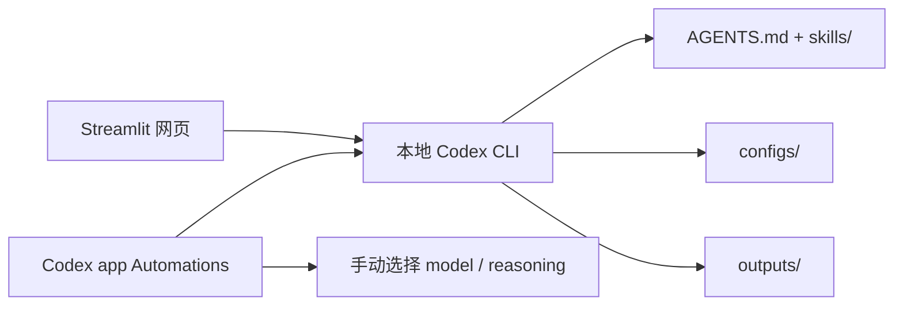

# Research Assistant

`research-assistant` 是一个面向本地使用场景的研究助手项目：网页负责参数配置、结果展示和配置落盘，本地 `Codex CLI` 负责实际执行研究任务，`Codex app` 继续负责 Automations。默认使用你本机已经登录的 `Codex CLI`，优先复用 ChatGPT 订阅访问能力，而不是默认要求 `OpenAI API key`。

## 项目简介

这个项目的目标不是做一个云端 SaaS，而是把常见研究工作流整理成一个本地可运行、可扩展、可复用的工具箱。当前重点是：

- 用网页统一收集研究参数、展示状态和回读结果
- 用本地 `codex exec` 执行真实任务，而不是只生成 prompt
- 用 `AGENTS.md + skills + configs` 固化研究流程
- 用 `outputs/` 保存结构化产出，方便网页再次读取

默认执行链路如下：



## 核心功能

- `Top 10 文献巡检`：收集主题、时间窗、来源和排序偏好，执行后写入 `outputs/daily_top10/`
- `单篇论文精读`：支持 arXiv ID、DOI、URL、本地 PDF，结果写入 `outputs/paper_summaries/`
- `方向论文地图`：围绕主题输出方向地图与阅读顺序，结果写入 `outputs/topic_maps/`
- `想法可行性分析`：围绕想法、数据和资源约束输出可行性报告，结果写入 `outputs/feasibility_reports/`
- `资源受限探索`：在算力、时间、数据约束下给出更可落地的方向建议，结果写入 `outputs/constraint_reports/`
- `PDF 下载`：调用本地脚本真实下载 PDF 到 `outputs/pdfs/`，可串联后续精读
- `自动化配置`：写入每日巡检配置，并生成适合粘贴到 Codex app Automation 的 prompt

## 项目结构

```text
research-assistant/
├── AGENTS.md
├── LICENSE
├── README.md
├── requirements.txt
├── configs/
│   ├── automations/daily_top10.yaml
│   ├── daily_profile.yaml
│   ├── execution_profiles.yaml
│   ├── interesting_papers.json
│   ├── ranking_profiles.md
│   └── source_policies.md
├── outputs/
│   ├── README.md
│   ├── daily_top10/
│   ├── paper_summaries/
│   ├── topic_maps/
│   ├── feasibility_reports/
│   ├── constraint_reports/
│   ├── pdfs/
│   └── prompt_requests/
├── skills/
│   ├── constraint-aware-explorer/
│   ├── idea-feasibility/
│   ├── literature-scout/
│   ├── paper-fetcher/
│   ├── paper-reader/
│   └── topic-mapper/
└── ui/
    ├── app.py
    ├── launcher.py
    ├── pages/
    └── services/
```

## 安装步骤

推荐环境：

- Python `3.10+`
- 已安装并可执行的 `Codex CLI`
- macOS / Linux / Windows 均可，以下命令以 Unix shell 为例

安装依赖：

```bash
python -m venv .venv
source .venv/bin/activate
python -m pip install --upgrade pip
python -m pip install -r requirements.txt
```

如果你不想创建虚拟环境，也可以直接执行最后两条 `pip` 命令。

## Codex CLI 登录方式

本项目默认不是“先配 API key 再跑网页”，而是“先确认本地 `Codex CLI` 已经能用 ChatGPT 登录，然后网页直接调用它”。

推荐检查顺序：

```bash
codex --version
codex login
codex login status
```

建议优先使用 ChatGPT 登录。如果 `codex login status` 中能看到类似 `Logged in using ChatGPT` 的提示，就说明本项目默认路径已经就绪。

关键说明：

- 不需要先启动 `Codex app` 才能跑网页
- 不需要让 `codex` 常驻后台
- 不需要默认提供 `OPENAI_API_KEY`
- 网页会在点击执行时按需调用 `codex exec`

## 如何启动网页

只要你已经完成过 `codex login`，并且 `codex login status` 正常，就可以直接在终端运行：

```bash
python ui/launcher.py
```

这一步的含义是：

- 不是“先登录一次网页，再运行命令”
- 而是“确认本机的 `Codex CLI` 已登录后，直接运行网页启动命令”

启动器会自动完成这些预检查：

- 检查 `Codex CLI` 是否安装
- 检查 `codex` 命令是否可执行
- 检查当前是否已登录
- 打开本地浏览器页面

如果 `Codex CLI` 未安装或未登录，网页仍然可以打开，但研究类页面不会伪装执行成功，会明确提示当前只能保留 prompt request 或手动桥接。

## 如何使用主要页面

| 页面 | 用途 | 主要输入 | 主要输出 |
| --- | --- | --- | --- |
| 首页 | 查看本地状态、默认配置、最近产物 | 无 | 环境状态、配置摘要、最近结果 |
| Top 10 文献巡检 | 按主题做结构化检索与排序 | 方向、时间窗、来源、排序 profile、约束、Top K | `outputs/daily_top10/` 下的 Markdown + JSON |
| 单篇论文精读 | 深入理解一篇论文 | arXiv ID / DOI / URL / 本地 PDF、摘要深度 | `outputs/paper_summaries/` 下的 Markdown + JSON |
| 方向论文地图 | 做主题梳理与阅读路线设计 | topic、时间窗、返回数量、是否跨领域 | `outputs/topic_maps/` 下的 Markdown + JSON |
| 想法可行性分析 | 判断想法是否值得做 | idea、目标领域、算力/数据预算、风险偏好 | `outputs/feasibility_reports/` 下的 Markdown + JSON |
| 资源受限探索 | 在真实约束下筛选更可做的方向 | 研究方向、算力限制、数据限制、是否偏复现 | `outputs/constraint_reports/` 下的 Markdown + JSON |
| PDF 下载 | 把论文下载到本地，并可串联精读 | 论文链接 / arXiv ID / DOI、本地文件名 | `outputs/pdfs/` 下的 PDF 与来源 sidecar |
| 自动化配置 | 保存每日巡检配置并生成 automation prompt | 任务名、研究领域、时间范围、来源、档位、调度时间 | `configs/daily_profile.yaml`、`configs/automations/daily_top10.yaml`、automation prompt |

推荐最小体验路径：

1. 打开 `PDF 下载` 页面，输入一个 arXiv ID，确认 PDF 能落盘。
2. 打开 `单篇论文精读` 页面，基于刚下载的论文做一次摘要。
3. 打开 `Top 10 文献巡检` 页面，跑一次小范围主题巡检。
4. 打开 `自动化配置` 页面，保存一份每日巡检配置并复制 prompt。

## 自动化如何配置

当前自动化页面的职责是：

1. 写入 `configs/daily_profile.yaml`
2. 写入 `configs/automations/daily_top10.yaml`
3. 根据当前配置生成固定 automation prompt
4. 让你把该 prompt 粘贴到 `Codex app` 的 Automation 创建界面

建议使用方式：

- 在网页的 `自动化配置` 页面设置每日巡检参数
- 复制页面生成的 automation prompt
- 在 `Codex app` 中新建 Automation
- 将 prompt 粘贴进去
- 根据网页推荐手动选择 `model` 和 `reasoning effort`

当前自动化边界：

- 网页会保存 `quality_profile`
- 网页会给出推荐的 `model / reasoning effort`
- 但 `Codex app Automation` 的实际 `model / reasoning effort` 仍需在 App 中手动选择，网页尚未完全接管这一步

## 当前能力边界

目前这个仓库已经适合公开展示和本地部署，但能力边界需要明确：

- 默认依赖本地可执行的 `Codex CLI`；若未安装或未登录，研究页面不会真正执行
- `Codex app Automation` 的 `model / reasoning effort` 仍需手动设置
- 本地 PDF 的文本抽取质量受源文件质量影响，证据不足时应接受“不确定”结果
- `outputs/` 是本地产物目录，不应默认提交运行结果、下载的 PDF 或 prompt request
- `configs/daily_profile.yaml` 与 `configs/automations/daily_top10.yaml` 会被网页真实改写；公开提交前应确认里面没有个人研究方向、私有约束或敏感信息

## 仓库提交建议

建议提交的内容：

- 所有源码：`ui/`、`skills/`
- 全局规则：`AGENTS.md`
- 默认配置与说明：`configs/`
- 仓库元信息：`README.md`、`.gitignore`、`LICENSE`、`requirements.txt`
- `outputs/` 目录骨架和 `.gitkeep`

建议不要提交的内容：

- `outputs/` 下的运行结果
- `outputs/pdfs/` 下下载的 PDF
- `outputs/prompt_requests/` 下的 prompt 回放文件
- `__pycache__/`、`.pyc`、`.DS_Store`
- 任何包含个人研究主题、私有路径、账号信息或临时实验结果的本地改写配置

`outputs/` 目录的提交策略见 [outputs/README.md](/Users/andywu/Documents/codex_workplace/projects/research-assistant/outputs/README.md)。

## License

仓库当前附带 `MIT License`，适合作为初始公开版本使用。如果你希望改成更严格或带专利条款的许可证，请在首次公开前替换。
