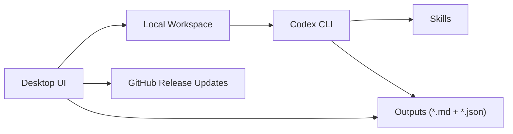

# Research Assistant

[简体中文](README.md) | [English](README.en.md)

> 当前版本来源：root `VERSION`（当前为 `1.1.1`）
>
> 最新已发布 release：`v1.1.0`

`research-assistant` 是一个本地桌面研究工作台。桌面 UI 负责参数配置、状态展示、结果回读和更新提示；真实任务执行由本地 `Codex CLI` 完成；macOS / Windows 安装包都会在首次启动时自动准备本地 Codex CLI 运行环境；GitHub Releases 作为默认更新源。

这不是浏览器套壳，也不是只生成 prompt 的外壳。

## 仓库规范

- 贡献说明：[`CONTRIBUTING.md`](CONTRIBUTING.md)
- 安全策略：[`SECURITY.md`](SECURITY.md)
- Windows 构建工作流：[`build-windows-installer.yml`](.github/workflows/build-windows-installer.yml)

## 一句话架构


```mermaid
flowchart LR
    A["Desktop UI"] --> B["Local Workspace"]
    B --> C["Codex CLI"]
    C --> D["Skills"]
    C --> E["Outputs (*.md + *.json)"]
    A --> E
    A --> F["GitHub Release Updates"]
```

## 当前能力

- 本地配置研究任务
- 通过本地 `Codex CLI` 执行真实任务
- macOS / Windows 安装包首次启动自动准备 `Codex CLI`，无需手工安装
- 回读 Markdown 与 JSON 结果
- 管理本地自动化任务
- 构建 macOS `.app` / `.pkg`
- 构建 Windows 一体安装包 `.exe`
- 从 GitHub Releases 检查更新并下载安装包

## 平台与打包

| 平台 | 桌面界面 | 运行时工作区 | 构建方式 | 安装产物 |
| --- | --- | --- | --- | --- |
| macOS | 镜像后的 PySide6 子树，且当前是 verified baseline | `~/Library/Application Support/Research Assistant/workspace` | 必须在 macOS 主机构建 | `.app` + `.pkg` |
| Windows | 基于 macOS 基线镜像出的 PySide6 子树 | `%LOCALAPPDATA%\\Research Assistant\\workspace` | 必须在 Windows 主机或 Windows CI 构建 | `.exe` |

说明：

- 当前仓库已拆分为 `MacOS/` 与 `Windows/` 两个对称子树；当前阶段以 `MacOS/` 为已验证基线，再镜像到 `Windows/`。
- Windows 安装器默认安装到 `%LOCALAPPDATA%\\Programs\\Research Assistant`，不会覆盖用户工作区数据。

## 项目结构

```text
research-assistant/
├── .github/workflows/
├── VERSION
├── MacOS/
│   ├── desktop/
│   ├── research_assistant/
│   ├── configs/
│   ├── outputs/
│   ├── packaging/
│   ├── scripts/
│   └── skills/
├── Windows/
│   ├── desktop/
│   ├── research_assistant/
│   ├── configs/
│   ├── outputs/
│   ├── packaging/
│   ├── scripts/
│   └── skills/
├── desktop/
│   └── main.py
├── scripts/
│   ├── bootstrap.py
│   ├── build_installer.py
│   ├── run_automation.py
│   ├── smoke_test.py
│   └── install_mac.sh
├── requirements.txt
├── README.md
└── README.en.md
```

目录职责：

- `MacOS/`: 当前 macOS 已验证基线；本地运行、打包和签名流程都从这里进入
- `Windows/`: 与 `MacOS/` 对称的 Windows 子树；用于后续 Windows 专项演进与 CI 构建
- root 目录：保留仓库文档、工作流、统一版本来源以及最小兼容入口

当前 root 已收敛为 thin compatibility layer，仅保留这些兼容入口：

- `desktop/main.py`
- `scripts/bootstrap.py`
- `scripts/build_installer.py`
- `scripts/run_automation.py`
- `scripts/smoke_test.py`
- `scripts/install_mac.sh`
- `requirements.txt`

这些兼容入口只负责转发到 `MacOS/` 或 `Windows/`，不再承载完整业务实现。

已经从 root 退役的重复实现：

- `research_assistant/`
- `packaging/`
- `skills/`
- `desktop/app.py`
- `desktop/runtime.py`
- root 下 tracked 的默认 `configs/` 模板
- root 下 tracked 的 `outputs/` 占位文件

说明：

- 你本机如果还保留历史 root `configs/` / `outputs/` 运行数据，它们可能仍存在于磁盘，但已不再是仓库追踪的官方实现内容。
- 仓库当前的官方实现与官方构建链只保留在 `MacOS/` 与 `Windows/`。

## 运行时工作区

开发态：

- macOS 推荐直接使用 `MacOS/` 子树作为工作区
- Windows 推荐直接使用 `Windows/` 子树作为工作区
- root 仅保留 thin compatibility layer，可继续兼容旧入口命令，但不再是首选工作区

打包态：

- macOS 首次启动会同步到 `~/Library/Application Support/Research Assistant/workspace`
- 若系统未安装 `Codex CLI`，macOS 首次启动还会在 `~/Library/Application Support/Research Assistant/runtime/codex/` 下准备应用托管的 Node.js / Codex CLI 运行时
- Windows 首次启动会同步到 `%LOCALAPPDATA%\\Research Assistant\\workspace`
- 若系统未安装 `Codex CLI`，Windows 首次启动还会在 `%LOCALAPPDATA%\\Research Assistant\\runtime\\codex\\` 下准备应用托管的 Node.js / Codex CLI 运行时
- 用户配置、自动化状态和输出结果都写入对应工作区

## 本地启动

```bash
python -m venv .venv
source .venv/bin/activate
python -m pip install --upgrade pip
python -m pip install -r MacOS/requirements.txt
python MacOS/desktop/main.py
```

可选入口：

```bash
python MacOS/scripts/bootstrap.py
```

兼容入口仍可用，但只做转发：

```bash
python desktop/main.py
python scripts/bootstrap.py
```

## Codex CLI 依赖

研究任务依赖本地 `Codex CLI`，但 macOS / Windows 打包态都已经内置自动准备流程，因此用户**不需要手工安装 Codex CLI**。

当前安装包行为：

- macOS / Windows 首次启动都会优先探测系统里已有的 `codex`
- 若缺失，会自动准备可用的 Node.js / npm，并把 `Codex CLI` 安装到应用托管目录
- 若尚未登录，会自动打开终端或命令行窗口执行 `codex login`
- 因此当前桌面安装体验已经免掉“自行安装 Codex CLI”这一步；通常只需要完成一次登录授权

推荐检查：

```bash
codex --version
codex login status
```

当前行为：

- 程序优先读取当前 `PATH`
- 也会探测应用托管的 `Codex CLI`
- macOS / Windows GUI 启动时也会探测常见安装路径
- 若 `codex login status` 可用，桌面端会直接调用本地 CLI

## 自动化

查看状态：

```bash
python MacOS/desktop/main.py --status
```

强制执行当前自动化：

```bash
python MacOS/scripts/run_automation.py --active-only --force
```

启动本地调度器：

```bash
python MacOS/scripts/run_automation.py --daemon
```

## 构建安装包

先安装依赖：

```bash
python -m pip install -r MacOS/requirements.txt
python -m pip install -r MacOS/packaging/requirements-build.txt
```

版本来源：

- 默认从 root `VERSION` 读取
- 当前值：`1.1.1`
- 需要临时覆盖时，仍可显式传 `--version <version>`

### macOS

构建：

```bash
python MacOS/scripts/build_installer.py --platform macos
```

产物：

- `MacOS/dist/installers/macos/pyinstaller/Research Assistant.app`
- `MacOS/dist/installers/macos/ResearchAssistant-macos-1.1.1.pkg`

签名与公证：

```bash
source MacOS/packaging/macos/signing.env
bash MacOS/packaging/macos/store_notary_credentials.sh
python MacOS/packaging/macos/sign_and_notarize.py
```

### Windows

硬约束：

- 必须在 Windows 主机上构建，或使用仓库内的 Windows GitHub Actions workflow
- 需要安装 NSIS，用于生成一体安装包 `.exe`

本机构建前准备：

```powershell
python -m pip install -r Windows/requirements.txt
python -m pip install -r Windows/packaging/requirements-build.txt
winget install NSIS.NSIS
```

构建：

```powershell
python Windows/scripts/build_installer.py --platform windows
```

产物：

- `Windows/dist/installers/windows/pyinstaller/Research Assistant/`
- `Windows/dist/installers/windows/ResearchAssistant-windows-1.1.1.exe`

CI 方案：

- 工作流文件：`.github/workflows/build-windows-installer.yml`
- 推送 `v*` tag 时会构建并上传 Windows 安装包
- 普通 `main` push 默认只构建 workflow artifact，不再默认上传到最新 release
- 手动触发时若不显式给 `version`，会优先读取 root `VERSION`

## 更新检查

顶栏显示当前版本，并提供 `检查更新` 按钮。

默认行为：

- 启动时自动检查
- 自动检查节流为每 24 小时一次
- 从 GitHub Releases 按平台匹配安装包
- macOS 下载 `.pkg`
- Windows 下载 `.exe`

默认更新配置位于各子树内：

- `MacOS/configs/app_update.yaml`
- `Windows/configs/app_update.yaml`

打包态会以对应子树中的默认配置作为模板，再同步到平台工作区。

```yaml
provider: github_release
github_repo: AndyWu0719/research-assistant
github_asset_pattern: ""
github_asset_pattern_by_platform:
  macos: ResearchAssistant-macos-*.pkg
  windows: ResearchAssistant-windows-*.exe
github_token_env: ""
manifest_url: ""
channel: stable
check_on_launch: true
check_interval_hours: 24
download_in_app: true
open_download_in_browser: false
```

发布流程：

1. 构建对应平台安装包
2. 推送代码和版本 tag
3. 创建 GitHub Release
4. 上传对应平台安装包资产

## 验证

```bash
python MacOS/scripts/smoke_test.py
```

当前 smoke test 会检查：

- 桌面窗口是否可实例化
- Codex CLI 状态
- 调度器状态
- PDF resolve-only 路径
- 基础更新检查行为

Windows 安装包 UI 验证：

- 工作流文件：`.github/workflows/validate-windows-installer-ui.yml`
- 会从 GitHub Release 下载 `ResearchAssistant-windows-<version>.exe`
- 在 GitHub Hosted Windows runner 上静默安装、启动应用、截屏并上传 artifact
- 会附带一份 `Windows vs macOS UI parity` 分析，说明哪些部分一致，哪些部分会因系统字体和窗口边框而不同

报告目录：

- `MacOS/outputs/smoke_tests/`：本地 macOS smoke test 报告
- Windows UI 验证报告由 GitHub Actions 作为 artifact 上传，不写入本地 root `outputs/`

## 已知限制

- 研究质量仍然依赖外部检索质量和本地 `Codex CLI`
- Windows 安装包目前只能在 Windows 原生环境或 Windows CI 中生成
- GitHub 更新依赖你在 Release 中上传正确的平台安装包
- 公共分发仍需要你自己的 Apple / Windows 签名体系
- root 当前只保留 thin compatibility layer
- release tag 仍建议使用带前缀形式，如 `v1.1.1`
- 版本文件 `VERSION` 使用裸版本，如 `1.1.1`
- 默认资产名会跟随版本生成：`ResearchAssistant-macos-1.1.1.pkg` / `ResearchAssistant-windows-1.1.1.exe`
