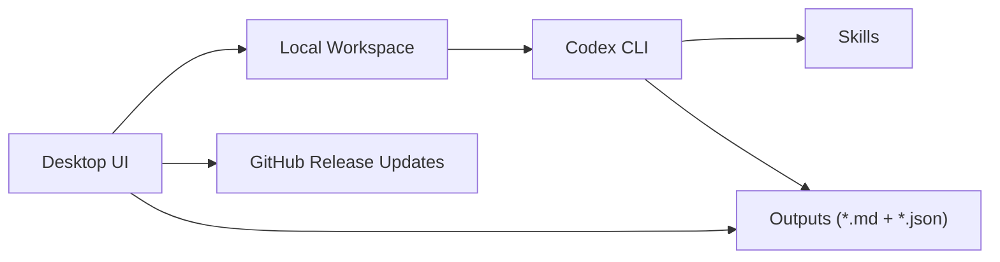

# Research Assistant

[简体中文](README.md) | [English](README.en.md)

> 当前版本: `Version 1.0.0`

`research-assistant` 是一个本地桌面研究工作台。桌面 UI 负责参数配置、状态展示、结果回读和更新提示；真实任务执行由本地 `Codex CLI` 完成；GitHub Releases 作为默认更新源。

这不是浏览器套壳，也不是只生成 prompt 的外壳。

## 仓库规范

- 贡献说明：[`CONTRIBUTING.md`](CONTRIBUTING.md)
- 安全策略：[`SECURITY.md`](SECURITY.md)
- Windows 构建工作流：[`build-windows-installer.yml`](.github/workflows/build-windows-installer.yml)

## 一句话架构


```mermaid
flowchart LR
    A["Desktop UI"] --> B["Local Workspace"]
    B --> C["Codex CLI"]
    C --> D["Skills"]
    C --> E["Outputs (*.md + *.json)"]
    A --> E
    A --> F["GitHub Release Updates"]
```

## 当前能力

- 本地配置研究任务
- 通过本地 `Codex CLI` 执行真实任务
- 回读 Markdown 与 JSON 结果
- 管理本地自动化任务
- 构建 macOS `.app` / `.pkg`
- 构建 Windows 一体安装包 `.exe`
- 从 GitHub Releases 检查更新并下载安装包

## 平台与打包

| 平台 | 桌面界面 | 运行时工作区 | 构建方式 | 安装产物 |
| --- | --- | --- | --- | --- |
| macOS | 同一套 PySide6 UI | `~/Library/Application Support/Research Assistant/workspace` | 必须在 macOS 主机构建 | `.app` + `.pkg` |
| Windows | 同一套 PySide6 UI | `%LOCALAPPDATA%\\Research Assistant\\workspace` | 必须在 Windows 主机或 Windows CI 构建 | `.exe` |

说明：

- macOS 和 Windows 复用同一套桌面代码，功能与页面结构保持一致。
- Windows 安装器默认安装到 `%LOCALAPPDATA%\\Programs\\Research Assistant`，不会覆盖用户工作区数据。

## 项目结构

```text
research-assistant/
├── .github/workflows/
├── desktop/
├── research_assistant/
├── configs/
├── outputs/
├── packaging/
│   ├── macos/
│   └── windows/
├── scripts/
├── skills/
├── README.md
└── README.en.md
```

目录职责：

- `desktop/`: 桌面壳、页面、布局和入口
- `research_assistant/`: 执行桥接、prompt 构建、配置管理、结果加载、更新检查
- `configs/`: 默认配置、自动化配置、更新配置
- `outputs/`: 结果文件、下载文件、prompt 请求、smoke test 报告
- `packaging/`: 运行时依赖、构建依赖、macOS / Windows 打包脚本
- `scripts/`: 本地启动、自动化、打包、smoke 验证

## 运行时工作区

开发态：

- 默认直接使用当前仓库作为工作区

打包态：

- macOS 首次启动会同步到 `~/Library/Application Support/Research Assistant/workspace`
- Windows 首次启动会同步到 `%LOCALAPPDATA%\\Research Assistant\\workspace`
- 用户配置、自动化状态和输出结果都写入对应工作区

## 本地启动

```bash
python -m venv .venv
source .venv/bin/activate
python -m pip install --upgrade pip
python -m pip install -r requirements.txt
python desktop/main.py
```

可选入口：

```bash
python scripts/bootstrap.py
```

## Codex CLI 依赖

研究任务依赖本地 `Codex CLI`。

推荐检查：

```bash
codex --version
codex login status
```

当前行为：

- 程序优先读取当前 `PATH`
- macOS GUI 启动时也会探测常见安装路径
- 若 `codex login status` 可用，桌面端会直接调用本地 CLI

## 自动化

查看状态：

```bash
python desktop/main.py --status
```

强制执行当前自动化：

```bash
python scripts/run_automation.py --active-only --force
```

启动本地调度器：

```bash
python scripts/run_automation.py --daemon
```

## 构建安装包

先安装依赖：

```bash
python -m pip install -r requirements.txt
python -m pip install -r packaging/requirements-build.txt
```

### macOS

构建：

```bash
python scripts/build_installer.py --platform macos --version 1.0.0
```

产物：

- `dist/installers/macos/pyinstaller/Research Assistant.app`
- `dist/installers/macos/ResearchAssistant-macos-1.0.0.pkg`

签名与公证：

```bash
source packaging/macos/signing.env
bash packaging/macos/store_notary_credentials.sh
python packaging/macos/sign_and_notarize.py --version 1.0.0
```

### Windows

硬约束：

- 必须在 Windows 主机上构建，或使用仓库内的 Windows GitHub Actions workflow
- 需要安装 NSIS，用于生成一体安装包 `.exe`

本机构建前准备：

```powershell
python -m pip install -r requirements.txt
python -m pip install -r packaging/requirements-build.txt
winget install NSIS.NSIS
```

构建：

```powershell
python scripts/build_installer.py --platform windows --version 1.0.0
```

产物：

- `dist/installers/windows/pyinstaller/Research Assistant/`
- `dist/installers/windows/ResearchAssistant-windows-1.0.0.exe`

CI 方案：

- 工作流文件：`.github/workflows/build-windows-installer.yml`
- 可手动触发，也会在推送 `v*` tag 时构建并上传 Windows 安装包

## 更新检查

顶栏显示当前版本，并提供 `检查更新` 按钮。

默认行为：

- 启动时自动检查
- 自动检查节流为每 24 小时一次
- 从 GitHub Releases 按平台匹配安装包
- macOS 下载 `.pkg`
- Windows 下载 `.exe`

默认配置文件：`configs/app_update.yaml`

```yaml
provider: github_release
github_repo: AndyWu0719/research-assistant
github_asset_pattern: ""
github_asset_pattern_by_platform:
  macos: ResearchAssistant-macos-*.pkg
  windows: ResearchAssistant-windows-*.exe
github_token_env: ""
manifest_url: ""
channel: stable
check_on_launch: true
check_interval_hours: 24
download_in_app: true
open_download_in_browser: false
```

发布流程：

1. 构建对应平台安装包
2. 推送代码和版本 tag
3. 创建 GitHub Release
4. 上传对应平台安装包资产

## 验证

```bash
python scripts/smoke_test.py
```

当前 smoke test 会检查：

- 桌面窗口是否可实例化
- Codex CLI 状态
- 调度器状态
- PDF resolve-only 路径
- 基础更新检查行为

报告目录：

- `outputs/smoke_tests/`

## 已知限制

- 研究质量仍然依赖外部检索质量和本地 `Codex CLI`
- Windows 安装包目前只能在 Windows 原生环境或 Windows CI 中生成
- GitHub 更新依赖你在 Release 中上传正确的平台安装包
- 公共分发仍需要你自己的 Apple / Windows 签名体系
